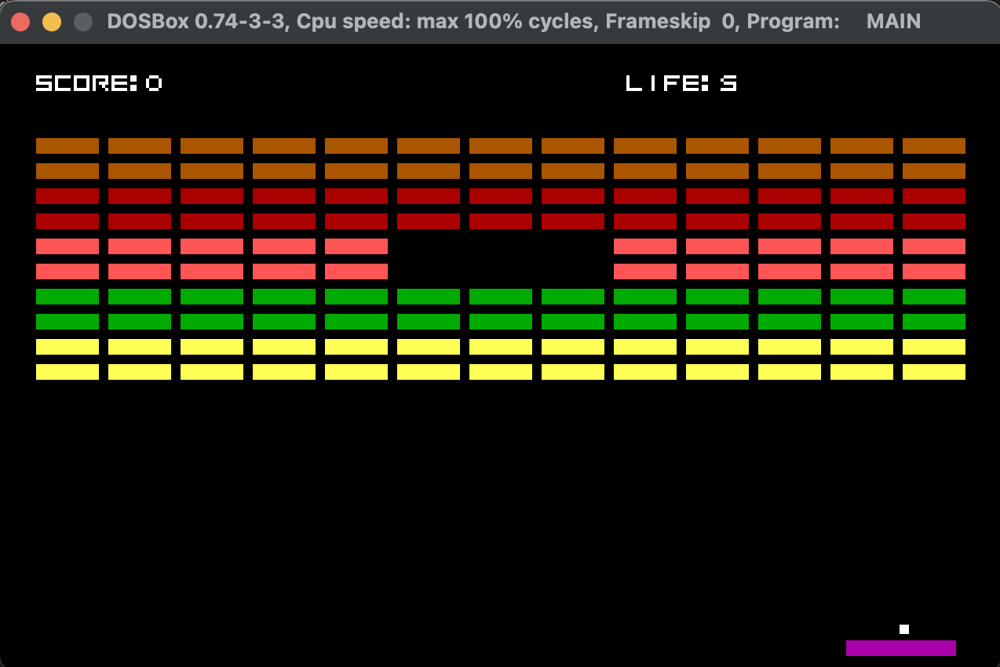
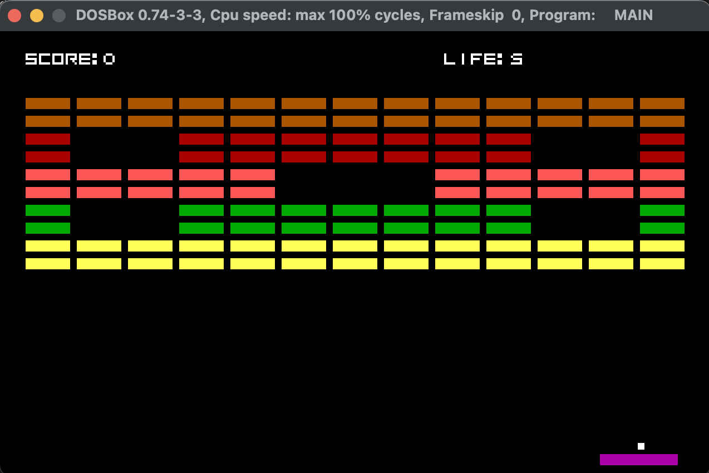

# Atari Breakout Re-implementation for DOS

### Overview

This project is a nostalgic re-implementation of the classic Atari Breakout game, designed specifically for DOS operating systems. Bringing back the retro gaming experience, this project aims to recreate the addictive gameplay and simple graphics of the original game.


### Features
+ Faithful recreation of the classic Atari Breakout gameplay.
+ Retro-style graphics and user interface reminiscent of early gaming consoles.
+ Simple controls for easy and intuitive gameplay.
+ 4 unique levels.

 
 

### Prerequisites
+ Turbo C++ (>= 3.0)
+ Turbo Assembler (>= 3.2)
+ DOSBox or a real DOS computer

### Building
To install the required build tools and compile the source files, follow these steps:

1. Ensure you have DOSBox installed on your system. If not, download and install DOSBox from [DOSBox website](https://www.dosbox.com/).

2. Open DOSBox and mount the directory containing the project files. For example, if the project files are located in a directory named `PROJECT` on the host machine, you can mount it in DOSBox using the following command:

```bash
mount C /path/to/PROJECT
```

3. Change to the mounted directory by typing:
```bash
C:
```

4. Navigate to the `TOOLS/tc3` directory within the project directory using DOS commands:
```bash
C:\>cd TOOLS\tc3
```


5. Run the installation executable `INSTALL.EXE` by typing its name and pressing Enter:
```bash
C:\>INSTALL.EXE
```

6. Follow the on-screen prompts to complete the installation of the required build tools.

7. Move the `MAKEFILE` and the source files into the `/TC/BIN/` directory within the project directory.

8. After moving the files, return to DOSBox and navigate to the `/TC/BIN/` directory:
```bash
C:\>cd /TC/BIN
```
and start the build process:
```bash
C:\>MAKE.EXE
```

### How to play
+ Use the arrow keys on your keyboard to move the paddle left and right.
+ Hit the ball with the paddle to break the bricks at the top of the screen.
+ Prevent the ball from falling off the bottom of the screen by keeping it in play with the paddle.
+ Try to break as many bricks as possible to score points and advance through levels.
+ Enjoy the nostalgic gaming experience of Atari Breakout on your DOS system!

### Contributing

Contributions to improve the game are welcome! If you have ideas for enhancements or bug fixes, feel free to fork the repository, make your changes, and submit a pull request.

### License

This project is licensed under the MIT License. See the LICENSE file for details.

### Credits

Developed by M. Sami Gürpınar


